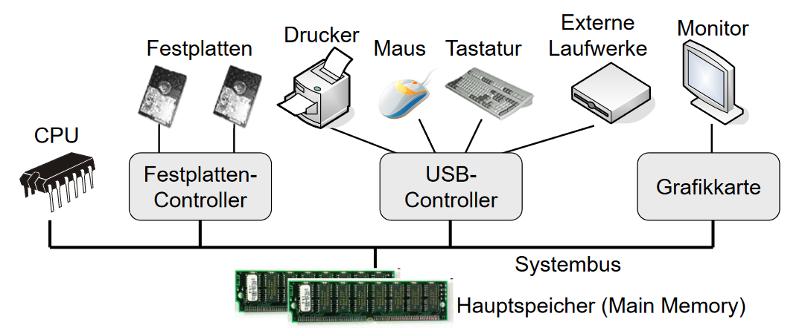
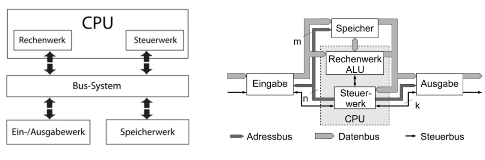
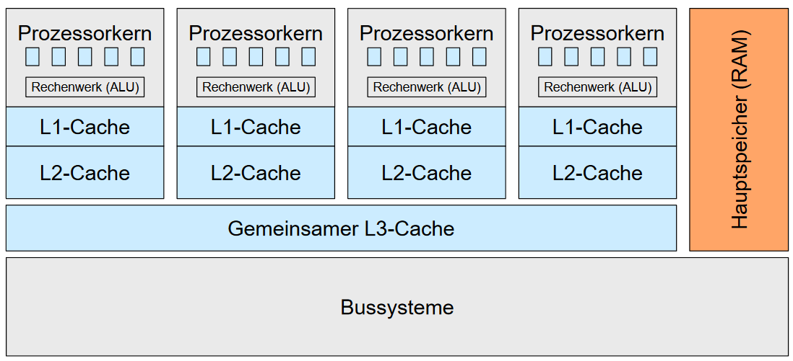
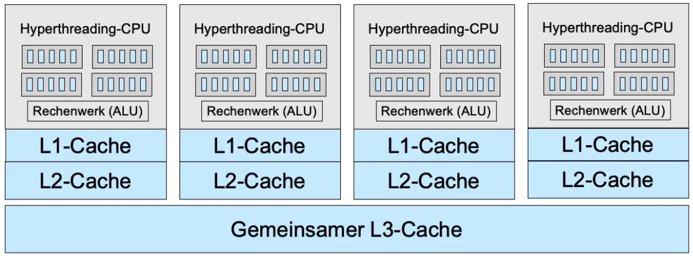
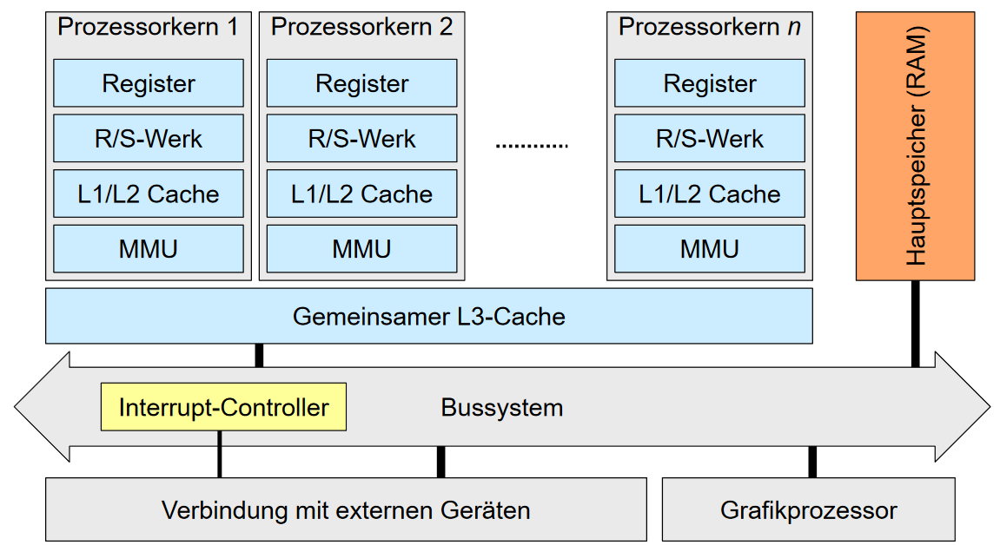

## Einteilung
Einteilung des gesamten Computers in vier Bereiche:
- Computer Hardware; Ansammlung von *Betriebsmitteln*, welche die
Ausführung von Programmen ermöglichen
- Betriebssystem; Verwaltung und *Koordination* der Hardware
- System- und Anwendungsprogramme 
- Benutzer; können Menschen sein, aber auch andere Computer

## Hardware
Der sogenannte *Systembus* verbindet alle Geräte des Computers
- CPU(s) zur Ausführung von Programmen
- Gemeinsamer Speicher für Aufgaben der CPU und anderer Geräte
- Controller zum Anschluss von I/O

## Rechnerarchitektur
### Von-Neumann Rechner

### Prozessor (CPU)
Verfügt über *Register* zur Ausführung von Operationen
- Datenregister, Adressregister, Spezialregister, ...

Zusätzlich verfügt eine CPU über *Caches* (L1/L2/L3)
- Schnellerer Pufferspeicher
- Zugriff auf Cache schneller als auf Hauptspeicher (RAM)
- Kleiner = Schneller (Level 1 in der Regel am kleinsten, dafür aber auch am schnellsten)
- Caches transparent für Betriebssystem - d.h. CPU kümmert sich um Management des Caches

#### Speicherstrukturen
Als Information interessant. Muss nicht für Klausur gelernt werden.

| Hierarchie-Ebene          | Größe             | Zugriffszeit (ns)     |
| ------------------------- | ----------------- | --------------------- |
| 1: Register               | 8 - 64 Bit        | << 1                  |
| 2: L1-Cache               | 16 - 64 KiB       | 1-2                   |
| 3: L2-Cache               | 64 KiB - 4 MiB    | 2-4                   |
| 4: L3-Cache               | 4 - 16 MiB        | 8-10                  |
| 5: Hauptspeicher (RAM)    | >1 GiB            | ~60                   |
| 6: Festplatte (SSD)       | >100 GiB          | ~5.000.000 (250.000)  |

#### Prozessorkerne und Caches

#### Prozessor Parallelismus Architekturen
- Pipelining
  - Das Ausführen einer Instruktion lässt sich in Unterinstruktionen aufteilen
    - z.B. Fetch, Decode, Execute, ...
  - Dadurch lässt sich ein Instruktionsparallelismus implementieren
  - Vorteil: Höherer Durchsatz
  - Nachteil: Tlw. höhere Latenz

Bild einfügen

- Superskalare Ausführung
  - Wenn mehr als eine *Ausführungseinheit* existiert,
können auch mehrere Instruktionen in der selben
Pipelinestage parallel ausgeführt werden

Bild einfügen

#### Hyperthreading
Als Information interessant. Muss nicht für Klausur gelernt werden.

Hyperthreading, oder Hardware-seitiges Multithreading:
- Mehrere Registersätze pro CPU, aber nur eine (oder weniger Rechenwerke)
- Reduzierte Umschaltzeiten (-> Task-Wechsel)
- Eine CPU-Core erscheint gegenüber dem Betriebssystem wie vier einzelne CPUs, aber mit reduzierter Leistung

In dem Bild ist klar erkennbar, dass jede "Hyperthreading-CPU" mehrere Register hat.

### Zusammenspiel der Hardware-Komponenten
- CPU führt Operationen aus
- CPU und I/O Geräte werden *nebenläufig* ausgeführt
  - Zur Ausführung einer Operation eines Gerätes wird die CPU benötigt
    - Jeder Controller hat eigene Register und einen lokalen Buffer (Cache)
    - Die CPU verschiebt Daten zwischen Hauptspeicher und Caches
    - Nach Verschieben der Daten wird die Operation gestartet
  - Heutzutage: *Direct Memory Access, DMA*
    - Separater Controller zum Verschieben von Daten zwischen CPU und Geräten
    - Entlastung der CPU

### Wesentliche Komponenten des Rechnersystems:

## Betriebssystem
**Definition:** Ein Betriebssystem ist eine Ansammlung von Programmen, die die effiziente und kofortable Nutzung der Computer-Hardware ermöglichen
- Platform zur Ausführung von Programmen auf einer Computer-Hardware
- Effiziente Aufteilung der *Betriebsmittel* (CPU, Festplatten, ...) auf mehrere Benuztzer bzw. Benutzerprogramme

### Betriebsmittel
Betriebsmittel können sowohl Hardware- aber auch Softwareressourcen sein
- Prozessoren, Prozesse, Threads
- Speicher
  - Hauptspeicher, Caches, virtueller Speicher
- Dateisystem
  - Verzeichnisse, Dateien
- I/O Geräte
  - Grafikkarte, Netzwerkkarte, Festplatte, Tastatur, ...

Betriebsmittel können auf verschiedene Arten klassifiziert werden. Wichtig sind
hier vor allem die folgenden Unterscheidungen:
- Exklusive oder geteilte Nutzung?
- Entziehbar oder nicht entziehbar?